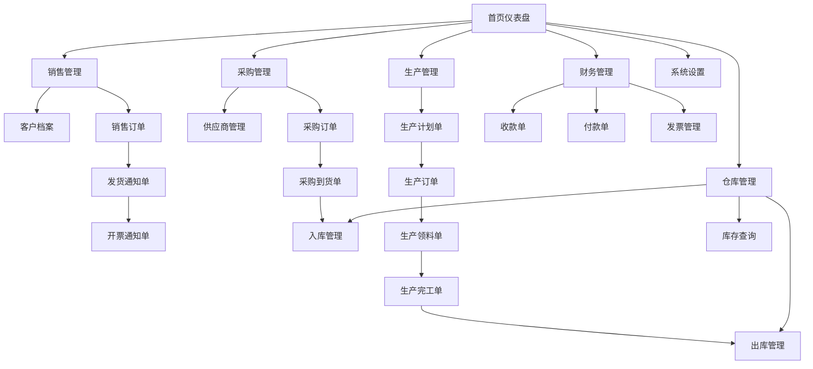

# ERP后台管理系统产品需求文档

## 1. Product Overview

本项目是一个通用型ERP后台管理系统，涵盖采购、销售、库存、财务、报表、系统管理等核心业务模块。

系统采用模块化设计，支持权限精细控制和审计追溯，为中小企业提供完整的资源规划和管理解决方案。目标是构建一个低耦合、高可维护、可扩展的现代化ERP系统。

## 2. Core Features

### 2.1 User Roles

| Role | Registration Method | Core Permissions |
|------|---------------------|------------------|
| 超级管理员 | 系统初始化创建 | 系统所有功能权限，用户管理，系统配置 |
| 管理员 | 超级管理员创建 | 业务模块管理，报表查看，基础数据维护 |
| 业务员 | 管理员创建 | 销售订单管理，客户档案维护 |
| 采购员 | 管理员创建 | 采购订单管理，供应商档案维护 |
| 仓管员 | 管理员创建 | 库存管理，出入库操作 |
| 财务员 | 管理员创建 | 财务管理，发票管理，收付款管理 |
| 生产员 | 管理员创建 | 生产订单管理，工艺路线管理 |

### 2.2 Feature Module

我们的ERP系统包含以下主要页面：

1. **首页仪表盘**：关键业务指标展示，快捷操作入口
2. **销售管理**：客户档案、销售订单、发货通知、开票通知、退货通知、销售报表
3. **生产计划**：生产计划单、物料清单、采购计划单、需求表
4. **采购管理**：供应商管理、采购订单、到货单、退货单、采购发票
5. **生产管理**：生产订单、领料单、完工单、入库单、退料单
6. **车间设置**：加工中心、生产线、班组设置、工人管理、工种设置、工艺路线
7. **仓库管理**：仓库列表、入库单据、出库单据、现存量查询
8. **入库管理**：采购入库、生产入库、其他入库
9. **出库管理**：销售出库、生产出库、其他出库
10. **退料退货**：采购退货、销售退货、生产退料
11. **盘点调拨**：盘点单、调拨单
12. **财务管理**：收款单、付款单、开票申请、销售发票、采购发票
13. **系统设置**：角色管理、部门管理、岗位管理、字典管理、人员明细、用户管理、日志管理、系统配置
14. **基础数据**：客户管理、供应商管理、商品管理、仓库管理

### 2.3 Page Details

| Page Name | Module Name | Feature description |
|-----------|-------------|---------------------|
| 首页仪表盘 | 数据概览 | 显示销售额、采购额、库存金额等关键指标，提供快捷操作入口 |
| 首页仪表盘 | 待办事项 | 显示待审批订单、库存预警、到期应收应付等提醒信息 |
| 销售管理 | 客户档案 | 新增、编辑、删除客户信息，支持导入导出，客户分类管理 |
| 销售管理 | 销售订单 | 创建销售订单，订单审批流程，订单状态跟踪，订单明细管理 |
| 销售管理 | 发货通知单 | 根据销售订单生成发货通知，发货状态管理，物流跟踪 |
| 销售管理 | 开票通知单 | 开票申请，发票信息管理，开票状态跟踪 |
| 销售管理 | 销售报表 | 销售统计分析，订单执行情况，客户销售排行 |
| 生产计划 | 生产计划单 | 制定生产计划，计划审批，计划执行跟踪 |
| 生产计划 | 物料清单 | BOM管理，物料需求计算，版本控制 |
| 采购管理 | 供应商管理 | 供应商档案维护，供应商评估，合作历史记录 |
| 采购管理 | 采购订单 | 创建采购订单，订单审批，供应商确认，到货跟踪 |
| 采购管理 | 采购到货单 | 到货登记，质量检验，入库确认 |
| 生产管理 | 生产订单 | 生产任务下达，生产进度跟踪，完工确认 |
| 生产管理 | 生产领料单 | 物料领用申请，库存扣减，领料记录 |
| 车间设置 | 加工中心 | 设备档案管理，设备状态监控，维护记录 |
| 车间设置 | 工艺路线 | 工艺流程定义，工序时间设定，工艺版本管理 |
| 仓库管理 | 仓库列表 | 仓库基础信息，仓库分区管理，库位设置 |
| 仓库管理 | 现存量 | 实时库存查询，库存预警设置，库存分析 |
| 入库管理 | 采购入库 | 采购物料入库，质检结果录入，入库单据生成 |
| 出库管理 | 销售出库 | 销售发货出库，出库单据生成，库存扣减 |
| 财务管理 | 收款单 | 客户收款登记，收款方式记录，应收账款核销 |
| 财务管理 | 付款单 | 供应商付款登记，付款方式记录，应付账款核销 |
| 系统设置 | 角色管理 | 角色定义，权限分配，角色用户关联 |
| 系统设置 | 用户管理 | 用户账号管理，密码重置，用户状态控制 |
| 系统设置 | 日志管理 | 操作日志查询，系统日志监控，审计追踪 |
| 基础数据 | 商品管理 | 商品档案维护，商品分类，规格型号管理 |

## 3. Core Process

### 销售流程
用户登录系统后，在销售管理模块创建客户档案，然后创建销售订单并提交审批。订单审批通过后，生成发货通知单安排发货，发货完成后创建开票通知单进行开票，最后在财务管理中登记收款。

### 采购流程
采购员在采购管理模块维护供应商信息，根据库存需求创建采购订单并提交审批。订单审批通过后发送给供应商，供应商发货后登记采购到货单，货物验收合格后办理采购入库，最后在财务管理中登记付款。

### 生产流程
生产计划员根据销售订单制定生产计划，创建生产订单下达生产任务。生产部门根据BOM清单创建领料单领取原材料，生产完成后填写完工单，合格产品办理生产入库。

### 库存管理流程
仓管员负责所有入库和出库操作，定期进行库存盘点，发现差异时创建盘点单进行调整。不同仓库间的货物转移通过调拨单实现。

## 4. User Interface Design

### 4.1 Design Style

- **主色调**：#3B82F6 (蓝色) 作为主色，#10B981 (绿色) 作为成功状态色
- **辅助色**：#6B7280 (灰色) 用于次要信息，#EF4444 (红色) 用于警告和错误
- **按钮样式**：圆角按钮设计，支持多种尺寸和状态
- **字体**：系统默认字体，标题使用 16-20px，正文使用 14px，小字使用 12px
- **布局风格**：左侧导航 + 顶部面包屑的经典后台布局，卡片式内容展示
- **图标风格**：使用 Heroicons 图标库，简洁现代的线性图标

### 4.2 Page Design Overview

| Page Name | Module Name | UI Elements |
|-----------|-------------|-------------|
| 首页仪表盘 | 数据概览 | 卡片式指标展示，使用渐变背景，图表采用 Chart.js，响应式网格布局 |
| 首页仪表盘 | 快捷操作 | 大图标按钮，悬停效果，快速跳转到常用功能 |
| 销售管理 | 订单列表 | 表格展示，支持筛选排序，状态标签用不同颜色区分，操作按钮右对齐 |
| 销售管理 | 订单详情 | 分步骤表单，进度条显示当前状态，字段分组展示 |
| 采购管理 | 供应商列表 | 卡片式布局，显示供应商头像、基本信息和合作状态 |
| 生产管理 | 生产看板 | 看板式布局，拖拽操作，不同阶段用不同背景色 |
| 仓库管理 | 库存查询 | 搜索框 + 高级筛选，库存数量用进度条可视化，低库存红色预警 |
| 财务管理 | 收付款 | 表单式录入，金额字段突出显示，支持附件上传 |
| 系统设置 | 权限管理 | 树形结构展示，复选框选择，权限继承关系可视化 |

### 4.3 Responsiveness

系统采用桌面优先设计，同时支持平板和手机端访问。在移动端，左侧导航收缩为抽屉式菜单，表格支持横向滚动，表单采用单列布局。触摸交互优化包括按钮最小点击区域44px，支持手势操作。