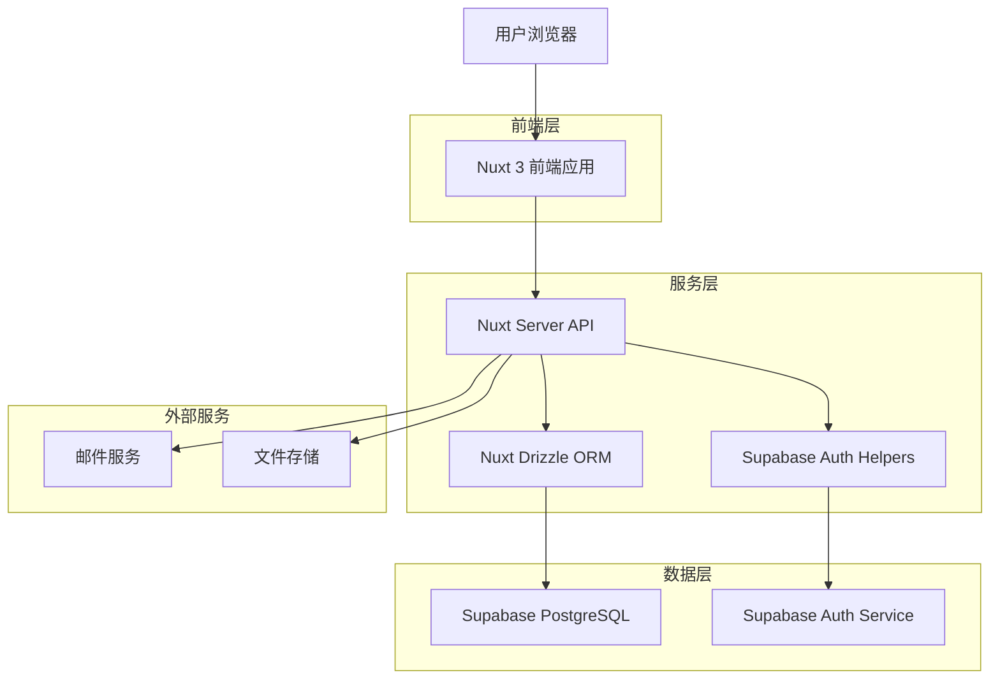
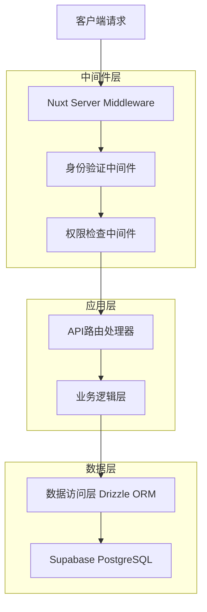
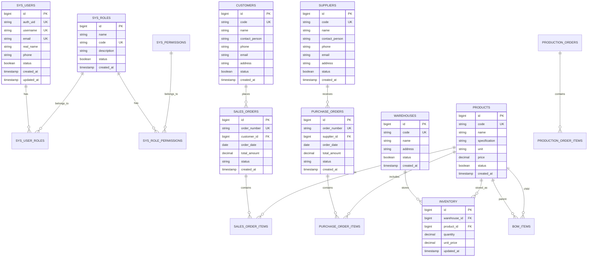

# ERP系统技术架构文档

## 1. Architecture design



## 2. Technology Description

* Frontend: Nuxt 3 + Vue 3 + Nuxt UI + TypeScript + Pinia + UnoCSS + Vite

* Backend: Nuxt Server API + Nuxt Drizzle

* Database: Supabase (PostgreSQL 15+)

* Authentication: Supabase Auth Helpers

* ORM: Drizzle ORM

* Testing: Vitest + Playwright

* Code Quality: ESLint + Prettier

## 3. Route definitions

| Route                | Purpose                |
| -------------------- | ---------------------- |
| /                    | 首页仪表盘，显示关键业务指标和快捷操作    |
| /login               | 用户登录页面，集成Supabase Auth |
| /sales               | 销售管理主页，包含客户和订单概览       |
| /sales/customers     | 客户档案管理页面               |
| /sales/orders        | 销售订单列表和管理              |
| /sales/delivery      | 发货通知单管理                |
| /sales/invoice       | 开票通知单管理                |
| /purchase            | 采购管理主页                 |
| /purchase/suppliers  | 供应商管理页面                |
| /purchase/orders     | 采购订单管理                 |
| /purchase/receipt    | 采购到货单管理                |
| /production          | 生产管理主页                 |
| /production/plans    | 生产计划管理                 |
| /production/orders   | 生产订单管理                 |
| /production/bom      | 物料清单管理                 |
| /workshop            | 车间设置主页                 |
| /workshop/centers    | 加工中心管理                 |
| /workshop/routes     | 工艺路线管理                 |
| /warehouse           | 仓库管理主页                 |
| /warehouse/inventory | 库存查询和管理                |
| /warehouse/inbound   | 入库管理                   |
| /warehouse/outbound  | 出库管理                   |
| /finance             | 财务管理主页                 |
| /finance/receivables | 收款管理                   |
| /finance/payables    | 付款管理                   |
| /finance/invoices    | 发票管理                   |
| /system              | 系统设置主页                 |
| /system/users        | 用户管理                   |
| /system/roles        | 角色权限管理                 |
| /system/logs         | 系统日志查看                 |
| /basic               | 基础数据管理主页               |
| /basic/products      | 商品档案管理                 |

## 4. API definitions

### 4.1 Core API

#### 用户认证相关

```
POST /api/auth/login
```

Request:

| Param Name | Param Type | isRequired | Description |
| ---------- | ---------- | ---------- | ----------- |
| email      | string     | true       | 用户邮箱        |
| password   | string     | true       | 用户密码        |

Response:

| Param Name | Param Type | Description |
| ---------- | ---------- | ----------- |
| success    | boolean    | 登录是否成功      |
| user       | object     | 用户信息        |
| token      | string     | 访问令牌        |

Example:

```json
{
  "email": "admin@example.com",
  "password": "123456"
}
```

#### 销售订单管理

```
GET /api/sales/orders
```

Request:

| Param Name | Param Type | isRequired | Description |
| ---------- | ---------- | ---------- | ----------- |
| page       | number     | false      | 页码，默认1      |
| limit      | number     | false      | 每页数量，默认20   |
| status     | string     | false      | 订单状态筛选      |
| customerId | number     | false      | 客户ID筛选      |

Response:

| Param Name | Param Type | Description |
| ---------- | ---------- | ----------- |
| success    | boolean    | 请求是否成功      |
| data       | array      | 订单列表        |
| total      | number     | 总记录数        |
| page       | number     | 当前页码        |

```
POST /api/sales/orders
```

Request:

| Param Name  | Param Type | isRequired | Description |
| ----------- | ---------- | ---------- | ----------- |
| customerId  | number     | true       | 客户ID        |
| orderDate   | string     | true       | 订单日期        |
| items       | array      | true       | 订单明细        |
| totalAmount | number     | true       | 订单总金额       |
| remark      | string     | false      | 备注信息        |

#### 采购订单管理

```
GET /api/purchase/orders
POST /api/purchase/orders
PUT /api/purchase/orders/:id
DELETE /api/purchase/orders/:id
```

#### 库存管理

```
GET /api/warehouse/inventory
POST /api/warehouse/inbound
POST /api/warehouse/outbound
```

#### 财务管理

```
GET /api/finance/receivables
POST /api/finance/receivables
GET /api/finance/payables
POST /api/finance/payables
```

#### 系统管理

```
GET /api/system/users
POST /api/system/users
GET /api/system/roles
POST /api/system/roles
GET /api/system/permissions
```

## 5. Server architecture diagram



## 6. Data model

### 6.1 Data model definition



### 6.2 Data Definition Language

#### 系统用户表 (sys\_users)

```sql
-- 创建用户表
CREATE TABLE sys_users (
    id BIGSERIAL PRIMARY KEY,
    auth_uid VARCHAR(64) NOT NULL UNIQUE,
    username VARCHAR(50) NOT NULL UNIQUE,
    email VARCHAR(120) NOT NULL UNIQUE,
    real_name VARCHAR(100),
    phone VARCHAR(20),
    avatar VARCHAR(255),
    status BOOLEAN NOT NULL DEFAULT true,
    last_login_at TIMESTAMP WITH TIME ZONE,
    created_at TIMESTAMP WITH TIME ZONE DEFAULT NOW(),
    updated_at TIMESTAMP WITH TIME ZONE DEFAULT NOW(),
    deleted_at TIMESTAMP WITH TIME ZONE
);

-- 创建索引
CREATE INDEX idx_sys_users_auth_uid ON sys_users(auth_uid);
CREATE INDEX idx_sys_users_email ON sys_users(email);
CREATE INDEX idx_sys_users_status ON sys_users(status);

-- RLS策略
ALTER TABLE sys_users ENABLE ROW LEVEL SECURITY;
CREATE POLICY "Users can view own profile" ON sys_users
FOR SELECT USING (auth.uid()::text = auth_uid);
```

#### 角色表 (sys\_roles)

```sql
CREATE TABLE sys_roles (
    id BIGSERIAL PRIMARY KEY,
    name VARCHAR(50) NOT NULL,
    code VARCHAR(30) NOT NULL UNIQUE,
    description VARCHAR(200),
    status BOOLEAN NOT NULL DEFAULT true,
    created_by BIGINT REFERENCES sys_users(id),
    created_at TIMESTAMP WITH TIME ZONE DEFAULT NOW(),
    updated_at TIMESTAMP WITH TIME ZONE DEFAULT NOW(),
    deleted_at TIMESTAMP WITH TIME ZONE
);

-- 初始化角色数据
INSERT INTO sys_roles (name, code, description) VALUES
('超级管理员', 'super_admin', '系统超级管理员，拥有所有权限'),
('管理员', 'admin', '系统管理员，拥有业务管理权限'),
('销售员', 'sales', '销售人员，负责销售业务'),
('采购员', 'purchase', '采购人员，负责采购业务'),
('仓管员', 'warehouse', '仓库管理员，负责库存管理'),
('财务员', 'finance', '财务人员，负责财务管理'),
('生产员', 'production', '生产人员，负责生产管理');
```

#### 客户表 (customers)

```sql
CREATE TABLE customers (
    id BIGSERIAL PRIMARY KEY,
    code VARCHAR(50) NOT NULL UNIQUE,
    name VARCHAR(100) NOT NULL,
    contact_person VARCHAR(50),
    phone VARCHAR(20),
    email VARCHAR(100),
    address TEXT,
    credit_limit DECIMAL(15,2) DEFAULT 0,
    status BOOLEAN NOT NULL DEFAULT true,
    created_by BIGINT REFERENCES sys_users(id),
    created_at TIMESTAMP WITH TIME ZONE DEFAULT NOW(),
    updated_at TIMESTAMP WITH TIME ZONE DEFAULT NOW(),
    deleted_at TIMESTAMP WITH TIME ZONE
);

CREATE INDEX idx_customers_code ON customers(code);
CREATE INDEX idx_customers_name ON customers(name);
CREATE INDEX idx_customers_status ON customers(status);
```

#### 商品表 (products)

```sql
CREATE TABLE products (
    id BIGSERIAL PRIMARY KEY,
    code VARCHAR(50) NOT NULL UNIQUE,
    name VARCHAR(100) NOT NULL,
    specification VARCHAR(200),
    unit VARCHAR(20) NOT NULL DEFAULT '个',
    category_id BIGINT,
    purchase_price DECIMAL(15,2),
    sale_price DECIMAL(15,2),
    min_stock DECIMAL(15,3) DEFAULT 0,
    max_stock DECIMAL(15,3) DEFAULT 0,
    status BOOLEAN NOT NULL DEFAULT true,
    created_by BIGINT REFERENCES sys_users(id),
    created_at TIMESTAMP WITH TIME ZONE DEFAULT NOW(),
    updated_at TIMESTAMP WITH TIME ZONE DEFAULT NOW(),
    deleted_at TIMESTAMP WITH TIME ZONE
);

CREATE INDEX idx_products_code ON products(code);
CREATE INDEX idx_products_name ON products(name);
CREATE INDEX idx_products_category ON products(category_id);
```

#### 销售订单表 (sales\_orders)

```sql
CREATE TYPE order_status AS ENUM ('DRAFT', 'PENDING', 'APPROVED', 'SHIPPED', 'COMPLETED', 'CANCELLED');

CREATE TABLE sales_orders (
    id BIGSERIAL PRIMARY KEY,
    order_number VARCHAR(50) NOT NULL UNIQUE,
    customer_id BIGINT NOT NULL REFERENCES customers(id),
    order_date DATE NOT NULL DEFAULT CURRENT_DATE,
    delivery_date DATE,
    total_amount DECIMAL(15,2) NOT NULL DEFAULT 0,
    discount_amount DECIMAL(15,2) DEFAULT 0,
    tax_amount DECIMAL(15,2) DEFAULT 0,
    status order_status DEFAULT 'DRAFT',
    remark TEXT,
    created_by BIGINT REFERENCES sys_users(id),
    created_at TIMESTAMP WITH TIME ZONE DEFAULT NOW(),
    updated_at TIMESTAMP WITH TIME ZONE DEFAULT NOW(),
    deleted_at TIMESTAMP WITH TIME ZONE
);

CREATE INDEX idx_sales_orders_number ON sales_orders(order_number);
CREATE INDEX idx_sales_orders_customer ON sales_orders(customer_id);
CREATE INDEX idx_sales_orders_date ON sales_orders(order_date);
CREATE INDEX idx_sales_orders_status ON sales_orders(status);
```

#### 库存表 (inventory)

```sql
CREATE TABLE inventory (
    id BIGSERIAL PRIMARY KEY,
    warehouse_id BIGINT NOT NULL REFERENCES warehouses(id),
    product_id BIGINT NOT NULL REFERENCES products(id),
    quantity DECIMAL(15,3) NOT NULL DEFAULT 0,
    available_quantity DECIMAL(15,3) NOT NULL DEFAULT 0,
    reserved_quantity DECIMAL(15,3) NOT NULL DEFAULT 0,
    unit_cost DECIMAL(15,2),
    last_in_date TIMESTAMP WITH TIME ZONE,
    last_out_date TIMESTAMP WITH TIME ZONE,
    updated_at TIMESTAMP WITH TIME ZONE DEFAULT NOW(),
    UNIQUE(warehouse_id, product_id)
);

CREATE INDEX idx_inventory_warehouse ON inventory(warehouse_id);
CREATE INDEX idx_inventory_product ON inventory(product_id);
CREATE INDEX idx_inventory_quantity ON inventory(quantity);
```

