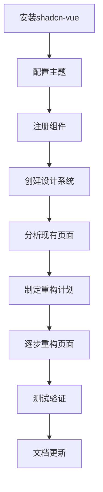

# ERP系统 shadcn-vue 组件使用规范

## 1. 项目概述

本文档针对当前ERP系统中shadcn-vue组件库使用不充分的问题，制定完整的组件使用规范和改进方案。目前UI目录中仅有少量组件，大部分页面未充分利用组件库的优势，导致UI不一致和开发效率低下。

## 2. 核心功能

### 2.1 组件分类

| 组件类型 | 使用场景                          | 优先级 |
| ---- | ----------------------------- | --- |
| 基础组件 | Button、Input、Select等表单元素      | 高   |
| 布局组件 | Card、Sheet、Dialog等容器组件        | 高   |
| 数据展示 | Table、Badge、Avatar等展示组件       | 中   |
| 反馈组件 | Toast、Alert、Loading等交互反馈      | 中   |
| 导航组件 | Breadcrumb、Tabs、Pagination等导航 | 低   |

### 2.2 功能模块

组件规范化改进包含以下核心页面：

1. **组件库搭建页面**：shadcn-vue组件安装配置、主题定制、组件注册
2. **设计系统页面**：颜色规范、字体规范、间距规范、组件使用示例
3. **页面重构指南**：现有页面组件化改造、最佳实践示例
4. **开发规范页面**：组件使用标准、代码风格指南、性能优化建议

### 2.3 页面详情

| 页面名称  | 模块名称 | 功能描述                       |
| ----- | ---- | -------------------------- |
| 组件库配置 | 安装配置 | 配置shadcn-vue，设置主题变量，注册全局组件 |
| 组件库配置 | 主题定制 | 自定义颜色方案，配置暗色模式，设置品牌色彩      |
| 设计系统  | 组件展示 | 展示所有可用组件，提供使用示例和API文档      |
| 设计系统  | 设计规范 | 定义设计标准，包括颜色、字体、间距、圆角等      |
| 页面重构  | 重构示例 | 展示页面改造前后对比，提供重构最佳实践        |
| 页面重构  | 组件模板 | 提供常用页面模板，如列表页、详情页、表单页      |
| 开发规范  | 编码标准 | 定义组件使用规范，命名约定，文件组织结构       |
| 开发规范  | 性能指南 | 组件懒加载，按需引入，性能优化建议          |

## 3. 核心流程

### 组件库集成流程

1. 安装shadcn-vue → 配置主题变量 → 注册核心组件 → 创建组件库文档
2. 分析现有页面 → 识别可复用组件 → 制定重构计划 → 逐步替换原有实现

### 页面重构流程

1. 页面分析 → 组件拆分 → 选择合适的shadcn组件 → 实现组件化改造
2. 测试验证 → 样式调整 → 交互优化 → 文档更新



## 4. 用户界面设计

### 4.1 设计风格

* **主色调**：使用shadcn-vue默认的蓝色系 (#0F172A, #1E293B, #334155)

* **按钮样式**：统一使用shadcn Button组件，支持variant属性

* **字体**：Inter字体，配合shadcn的字体大小规范

* **布局风格**：基于shadcn Card组件的卡片式布局

* **图标风格**：统一使用Lucide图标，与shadcn-vue完美集成

### 4.2 页面设计概览

| 页面类型 | 主要组件                          | 设计特点                 |
| ---- | ----------------------------- | -------------------- |
| 列表页面 | Table, Card, Button, Input    | 统一的表格样式，搜索筛选区域，操作按钮组 |
| 表单页面 | Form, Input, Select, Textarea | 一致的表单布局，验证提示，提交按钮    |
| 详情页面 | Card, Badge, Separator        | 信息分组展示，状态标识，清晰的视觉层次  |
| 仪表板  | Card, Chart, Progress         | 数据可视化，进度指示，响应式网格布局   |

### 4.3 响应式设计

基于shadcn-vue的响应式断点系统，确保在不同设备上的一致体验。使用Tailwind CSS的响应式类名，配合shadcn组件的内置响应式特性。

## 5. 技术架构

### 5.1 组件库配置

```typescript
// nuxt.config.ts
export default defineNuxtConfig({
  modules: [
    '@nuxtjs/tailwindcss',
    'shadcn-nuxt'
  ],
  shadcn: {
    prefix: '',
    componentDir: './components/ui'
  },
  css: ['~/assets/css/main.css']
})
```

### 5.2 主题配置

```css
/* assets/css/main.css */
@tailwind base;
@tailwind components;
@tailwind utilities;

@layer base {
  :root {
    --background: 0 0% 100%;
    --foreground: 222.2 84% 4.9%;
    --card: 0 0% 100%;
    --card-foreground: 222.2 84% 4.9%;
    --popover: 0 0% 100%;
    --popover-foreground: 222.2 84% 4.9%;
    --primary: 221.2 83.2% 53.3%;
    --primary-foreground: 210 40% 98%;
    --secondary: 210 40% 96%;
    --secondary-foreground: 222.2 84% 4.9%;
    --muted: 210 40% 96%;
    --muted-foreground: 215.4 16.3% 46.9%;
    --accent: 210 40% 96%;
    --accent-foreground: 222.2 84% 4.9%;
    --destructive: 0 84.2% 60.2%;
    --destructive-foreground: 210 40% 98%;
    --border: 214.3 31.8% 91.4%;
    --input: 214.3 31.8% 91.4%;
    --ring: 221.2 83.2% 53.3%;
    --radius: 0.5rem;
  }

  .dark {
    --background: 222.2 84% 4.9%;
    --foreground: 210 40% 98%;
    --card: 222.2 84% 4.9%;
    --card-foreground: 210 40% 98%;
    --popover: 222.2 84% 4.9%;
    --popover-foreground: 210 40% 98%;
    --primary: 217.2 91.2% 59.8%;
    --primary-foreground: 222.2 84% 4.9%;
    --secondary: 217.2 32.6% 17.5%;
    --secondary-foreground: 210 40% 98%;
    --muted: 217.2 32.6% 17.5%;
    --muted-foreground: 215 20.2% 65.1%;
    --accent: 217.2 32.6% 17.5%;
    --accent-foreground: 210 40% 98%;
    --destructive: 0 62.8% 30.6%;
    --destructive-foreground: 210 40% 98%;
    --border: 217.2 32.6% 17.5%;
    --input: 217.2 32.6% 17.5%;
    --ring: 224.3 76.3% 94.1%;
  }
}
```

### 5.3 组件注册

```typescript
// plugins/shadcn.client.ts
import { Button } from '~/components/ui/button'
import { Input } from '~/components/ui/input'
import { Card, CardContent, CardDescription, CardFooter, CardHeader, CardTitle } from '~/components/ui/card'
import { Table, TableBody, TableCaption, TableCell, TableHead, TableHeader, TableRow } from '~/components/ui/table'
import { Dialog, DialogContent, DialogDescription, DialogFooter, DialogHeader, DialogTitle, DialogTrigger } from '~/components/ui/dialog'
import { Select, SelectContent, SelectItem, SelectTrigger, SelectValue } from '~/components/ui/select'
import { Badge } from '~/components/ui/badge'
import { Avatar, AvatarFallback, AvatarImage } from '~/components/ui/avatar'
import { Separator } from '~/components/ui/separator'
import { Tabs, TabsContent, TabsList, TabsTrigger } from '~/components/ui/tabs'
import { Form, FormControl, FormDescription, FormField, FormItem, FormLabel, FormMessage } from '~/components/ui/form'
import { Textarea } from '~/components/ui/textarea'
import { Checkbox } from '~/components/ui/checkbox'
import { RadioGroup, RadioGroupItem } from '~/components/ui/radio-group'
import { Switch } from '~/components/ui/switch'
import { Slider } from '~/components/ui/slider'
import { Progress } from '~/components/ui/progress'
import { Alert, AlertDescription, AlertTitle } from '~/components/ui/alert'
import { Toast, ToastAction, ToastClose, ToastDescription, ToastProvider, ToastTitle, ToastViewport } from '~/components/ui/toast'
import { Breadcrumb, BreadcrumbEllipsis, BreadcrumbItem, BreadcrumbLink, BreadcrumbList, BreadcrumbPage, BreadcrumbSeparator } from '~/components/ui/breadcrumb'
import { Pagination, PaginationContent, PaginationEllipsis, PaginationFirst, PaginationItem, PaginationLast, PaginationLink, PaginationNext, PaginationPrevious } from '~/components/ui/pagination'
import { Sheet, SheetClose, SheetContent, SheetDescription, SheetFooter, SheetHeader, SheetTitle, SheetTrigger } from '~/components/ui/sheet'
import { Skeleton } from '~/components/ui/skeleton'
import { DropdownMenu, DropdownMenuCheckboxItem, DropdownMenuContent, DropdownMenuItem, DropdownMenuLabel, DropdownMenuRadioGroup, DropdownMenuRadioItem, DropdownMenuSeparator, DropdownMenuShortcut, DropdownMenuSub, DropdownMenuSubContent, DropdownMenuSubTrigger, DropdownMenuTrigger } from '~/components/ui/dropdown-menu'

export default defineNuxtPlugin(() => {
  // 组件已通过auto-import自动注册
})
```

## 6. 页面重构指南

### 6.1 用户管理页面重构

#### 重构前问题

* 使用原生HTML表格，样式不统一

* 按钮样式各异，缺乏一致性

* 表单验证提示不规范

* 缺少加载状态和空状态处理

#### 重构后改进

```vue
<!-- pages/users.vue -->
<template>
  <div class="container mx-auto py-6">
    <!-- 页面标题 -->
    <div class="flex items-center justify-between mb-6">
      <div>
        <h1 class="text-3xl font-bold tracking-tight">用户管理</h1>
        <p class="text-muted-foreground">管理系统用户和权限</p>
      </div>
      <Button @click="openCreateDialog">
        <Plus class="mr-2 h-4 w-4" />
        新增用户
      </Button>
    </div>

    <!-- 搜索和筛选 -->
    <Card class="mb-6">
      <CardHeader>
        <CardTitle>搜索筛选</CardTitle>
      </CardHeader>
      <CardContent>
        <div class="grid grid-cols-1 md:grid-cols-4 gap-4">
          <div>
            <Label for="search">搜索用户</Label>
            <Input
              id="search"
              v-model="searchQuery"
              placeholder="输入用户名或邮箱"
              class="mt-1"
            />
          </div>
          <div>
            <Label for="department">部门</Label>
            <Select v-model="selectedDepartment">
              <SelectTrigger class="mt-1">
                <SelectValue placeholder="选择部门" />
              </SelectTrigger>
              <SelectContent>
                <SelectItem value="all">全部部门</SelectItem>
                <SelectItem v-for="dept in departments" :key="dept.id" :value="dept.id">
                  {{ dept.name }}
                </SelectItem>
              </SelectContent>
            </Select>
          </div>
          <div>
            <Label for="status">状态</Label>
            <Select v-model="selectedStatus">
              <SelectTrigger class="mt-1">
                <SelectValue placeholder="选择状态" />
              </SelectTrigger>
              <SelectContent>
                <SelectItem value="all">全部状态</SelectItem>
                <SelectItem value="active">激活</SelectItem>
                <SelectItem value="inactive">禁用</SelectItem>
              </SelectContent>
            </Select>
          </div>
          <div class="flex items-end">
            <Button @click="handleSearch" class="w-full">
              <Search class="mr-2 h-4 w-4" />
              搜索
            </Button>
          </div>
        </div>
      </CardContent>
    </Card>

    <!-- 用户列表 -->
    <Card>
      <CardHeader>
        <CardTitle>用户列表</CardTitle>
        <CardDescription>
          共 {{ totalUsers }} 个用户
        </CardDescription>
      </CardHeader>
      <CardContent>
        <Table>
          <TableHeader>
            <TableRow>
              <TableHead>用户</TableHead>
              <TableHead>部门</TableHead>
              <TableHead>角色</TableHead>
              <TableHead>状态</TableHead>
              <TableHead>创建时间</TableHead>
              <TableHead class="text-right">操作</TableHead>
            </TableRow>
          </TableHeader>
          <TableBody>
            <TableRow v-if="loading">
              <TableCell colspan="6" class="text-center py-8">
                <div class="flex items-center justify-center">
                  <Loader2 class="mr-2 h-4 w-4 animate-spin" />
                  加载中...
                </div>
              </TableCell>
            </TableRow>
            <TableRow v-else-if="users.length === 0">
              <TableCell colspan="6" class="text-center py-8">
                <div class="flex flex-col items-center">
                  <Users class="h-12 w-12 text-muted-foreground mb-2" />
                  <p class="text-muted-foreground">暂无用户数据</p>
                </div>
              </TableCell>
            </TableRow>
            <TableRow v-else v-for="user in users" :key="user.id">
              <TableCell>
                <div class="flex items-center space-x-3">
                  <Avatar>
                    <AvatarImage :src="user.avatar" :alt="user.name" />
                    <AvatarFallback>{{ user.name.charAt(0) }}</AvatarFallback>
                  </Avatar>
                  <div>
                    <div class="font-medium">{{ user.name }}</div>
                    <div class="text-sm text-muted-foreground">{{ user.email }}</div>
                  </div>
                </div>
              </TableCell>
              <TableCell>{{ user.department?.name || '-' }}</TableCell>
              <TableCell>
                <Badge v-for="role in user.roles" :key="role.id" variant="secondary" class="mr-1">
                  {{ role.name }}
                </Badge>
              </TableCell>
              <TableCell>
                <Badge :variant="user.status === 'active' ? 'default' : 'destructive'">
                  {{ user.status === 'active' ? '激活' : '禁用' }}
                </Badge>
              </TableCell>
              <TableCell>{{ formatDate(user.created_at) }}</TableCell>
              <TableCell class="text-right">
                <DropdownMenu>
                  <DropdownMenuTrigger asChild>
                    <Button variant="ghost" size="sm">
                      <MoreHorizontal class="h-4 w-4" />
                    </Button>
                  </DropdownMenuTrigger>
                  <DropdownMenuContent align="end">
                    <DropdownMenuItem @click="editUser(user)">
                      <Edit class="mr-2 h-4 w-4" />
                      编辑
                    </DropdownMenuItem>
                    <DropdownMenuItem @click="resetPassword(user)">
                      <Key class="mr-2 h-4 w-4" />
                      重置密码
                    </DropdownMenuItem>
                    <DropdownMenuSeparator />
                    <DropdownMenuItem 
                      @click="toggleUserStatus(user)"
                      :class="user.status === 'active' ? 'text-destructive' : 'text-green-600'"
                    >
                      <Ban v-if="user.status === 'active'" class="mr-2 h-4 w-4" />
                      <CheckCircle v-else class="mr-2 h-4 w-4" />
                      {{ user.status === 'active' ? '禁用' : '启用' }}
                    </DropdownMenuItem>
                  </DropdownMenuContent>
                </DropdownMenu>
              </TableCell>
            </TableRow>
          </TableBody>
        </Table>
      </CardContent>
      <CardFooter>
        <Pagination
          v-model:page="currentPage"
          :total="totalUsers"
          :page-size="pageSize"
          :show-size-changer="true"
          @update:page="handlePageChange"
          @update:page-size="handlePageSizeChange"
        />
      </CardFooter>
    </Card>

    <!-- 创建/编辑用户对话框 -->
    <Dialog v-model:open="showUserDialog">
      <DialogContent class="sm:max-w-[425px]">
        <DialogHeader>
          <DialogTitle>{{ editingUser ? '编辑用户' : '新增用户' }}</DialogTitle>
          <DialogDescription>
            {{ editingUser ? '修改用户信息' : '创建新的系统用户' }}
          </DialogDescription>
        </DialogHeader>
        <Form @submit="handleSubmit">
          <div class="grid gap-4 py-4">
            <FormField name="name">
              <FormItem>
                <FormLabel>用户名</FormLabel>
                <FormControl>
                  <Input v-model="userForm.name" placeholder="请输入用户名" />
                </FormControl>
                <FormMessage />
              </FormItem>
            </FormField>
            <FormField name="email">
              <FormItem>
                <FormLabel>邮箱</FormLabel>
                <FormControl>
                  <Input v-model="userForm.email" type="email" placeholder="请输入邮箱" />
                </FormControl>
                <FormMessage />
              </FormItem>
            </FormField>
            <FormField name="department_id">
              <FormItem>
                <FormLabel>部门</FormLabel>
                <FormControl>
                  <Select v-model="userForm.department_id">
                    <SelectTrigger>
                      <SelectValue placeholder="选择部门" />
                    </SelectTrigger>
                    <SelectContent>
                      <SelectItem v-for="dept in departments" :key="dept.id" :value="dept.id">
                        {{ dept.name }}
                      </SelectItem>
                    </SelectContent>
                  </Select>
                </FormControl>
                <FormMessage />
              </FormItem>
            </FormField>
          </div>
          <DialogFooter>
            <Button type="button" variant="outline" @click="showUserDialog = false">
              取消
            </Button>
            <Button type="submit" :disabled="submitting">
              <Loader2 v-if="submitting" class="mr-2 h-4 w-4 animate-spin" />
              {{ editingUser ? '更新' : '创建' }}
            </Button>
          </DialogFooter>
        </Form>
      </DialogContent>
    </Dialog>
  </div>
</template>

<script setup lang="ts">
import { Plus, Search, Edit, Key, Ban, CheckCircle, MoreHorizontal, Users, Loader2 } from 'lucide-vue-next'

// 页面数据
const { users, loading, fetchUsers, createUser, updateUser, deleteUser } = useUsers()
const { departments, fetchDepartments } = useDepartments()

// 搜索和筛选
const searchQuery = ref('')
const selectedDepartment = ref('all')
const selectedStatus = ref('all')

// 分页
const currentPage = ref(1)
const pageSize = ref(10)
const totalUsers = computed(() => users.value.length)

// 对话框状态
const showUserDialog = ref(false)
const editingUser = ref(null)
const submitting = ref(false)

// 表单数据
const userForm = reactive({
  name: '',
  email: '',
  department_id: ''
})

// 方法
const openCreateDialog = () => {
  editingUser.value = null
  resetForm()
  showUserDialog.value = true
}

const editUser = (user) => {
  editingUser.value = user
  Object.assign(userForm, user)
  showUserDialog.value = true
}

const handleSubmit = async () => {
  submitting.value = true
  try {
    if (editingUser.value) {
      await updateUser(editingUser.value.id, userForm)
    } else {
      await createUser(userForm)
    }
    showUserDialog.value = false
    await fetchUsers()
  } finally {
    submitting.value = false
  }
}

const resetForm = () => {
  Object.assign(userForm, {
    name: '',
    email: '',
    department_id: ''
  })
}

const handleSearch = () => {
  // 实现搜索逻辑
}

const handlePageChange = (page) => {
  currentPage.value = page
  fetchUsers()
}

const handlePageSizeChange = (size) => {
  pageSize.value = size
  currentPage.value = 1
  fetchUsers()
}

const formatDate = (date) => {
  return new Date(date).toLocaleDateString('zh-CN')
}

// 初始化
onMounted(() => {
  fetchUsers()
  fetchDepartments()
})
</script>
```

### 6.2 仪表板页面重构

```vue
<!-- pages/dashboard.vue -->
<template>
  <div class="container mx-auto py-6">
    <!-- 页面标题 -->
    <div class="mb-6">
      <h1 class="text-3xl font-bold tracking-tight">仪表板</h1>
      <p class="text-muted-foreground">欢迎回来，{{ user?.name }}</p>
    </div>

    <!-- 统计卡片 -->
    <div class="grid grid-cols-1 md:grid-cols-2 lg:grid-cols-4 gap-6 mb-6">
      <Card>
        <CardHeader class="flex flex-row items-center justify-between space-y-0 pb-2">
          <CardTitle class="text-sm font-medium">总销售额</CardTitle>
          <DollarSign class="h-4 w-4 text-muted-foreground" />
        </CardHeader>
        <CardContent>
          <div class="text-2xl font-bold">¥{{ formatCurrency(totalSales) }}</div>
          <p class="text-xs text-muted-foreground">
            <span class="text-green-600">+20.1%</span> 较上月
          </p>
        </CardContent>
      </Card>

      <Card>
        <CardHeader class="flex flex-row items-center justify-between space-y-0 pb-2">
          <CardTitle class="text-sm font-medium">订单数量</CardTitle>
          <ShoppingCart class="h-4 w-4 text-muted-foreground" />
        </CardHeader>
        <CardContent>
          <div class="text-2xl font-bold">{{ totalOrders }}</div>
          <p class="text-xs text-muted-foreground">
            <span class="text-green-600">+12.5%</span> 较上月
          </p>
        </CardContent>
      </Card>

      <Card>
        <CardHeader class="flex flex-row items-center justify-between space-y-0 pb-2">
          <CardTitle class="text-sm font-medium">库存预警</CardTitle>
          <AlertTriangle class="h-4 w-4 text-muted-foreground" />
        </CardHeader>
        <CardContent>
          <div class="text-2xl font-bold">{{ lowStockCount }}</div>
          <p class="text-xs text-muted-foreground">
            需要补货的商品
          </p>
        </CardContent>
      </Card>

      <Card>
        <CardHeader class="flex flex-row items-center justify-between space-y-0 pb-2">
          <CardTitle class="text-sm font-medium">活跃用户</CardTitle>
          <Users class="h-4 w-4 text-muted-foreground" />
        </CardHeader>
        <CardContent>
          <div class="text-2xl font-bold">{{ activeUsers }}</div>
          <p class="text-xs text-muted-foreground">
            <span class="text-red-600">-2.1%</span> 较上月
          </p>
        </CardContent>
      </Card>
    </div>

    <!-- 图表和列表 -->
    <div class="grid grid-cols-1 lg:grid-cols-2 gap-6">
      <!-- 销售趋势图 -->
      <Card>
        <CardHeader>
          <CardTitle>销售趋势</CardTitle>
          <CardDescription>最近30天的销售数据</CardDescription>
        </CardHeader>
        <CardContent>
          <!-- 这里可以集成图表组件 -->
          <div class="h-[300px] flex items-center justify-center border-2 border-dashed border-muted-foreground/25 rounded-lg">
            <p class="text-muted-foreground">销售趋势图表</p>
          </div>
        </CardContent>
      </Card>

      <!-- 最近订单 -->
      <Card>
        <CardHeader>
          <CardTitle>最近订单</CardTitle>
          <CardDescription>最新的订单信息</CardDescription>
        </CardHeader>
        <CardContent>
          <div class="space-y-4">
            <div v-for="order in recentOrders" :key="order.id" class="flex items-center space-x-4">
              <Avatar>
                <AvatarFallback>{{ order.customer.name.charAt(0) }}</AvatarFallback>
              </Avatar>
              <div class="flex-1 space-y-1">
                <p class="text-sm font-medium leading-none">{{ order.customer.name }}</p>
                <p class="text-sm text-muted-foreground">订单号: {{ order.order_number }}</p>
              </div>
              <div class="text-right">
                <p class="text-sm font-medium">¥{{ formatCurrency(order.total_amount) }}</p>
                <Badge :variant="getOrderStatusVariant(order.status)">
                  {{ getOrderStatusText(order.status) }}
                </Badge>
              </div>
            </div>
          </div>
        </CardContent>
      </Card>
    </div>
  </div>
</template>

<script setup lang="ts">
import { DollarSign, ShoppingCart, AlertTriangle, Users } from 'lucide-vue-next'

// 数据
const { user } = useAuth()
const totalSales = ref(1234567)
const totalOrders = ref(1234)
const lowStockCount = ref(23)
const activeUsers = ref(573)
const recentOrders = ref([])

// 方法
const formatCurrency = (amount) => {
  return new Intl.NumberFormat('zh-CN').format(amount)
}

const getOrderStatusVariant = (status) => {
  const variants = {
    pending: 'secondary',
    confirmed: 'default',
    shipped: 'default',
    delivered: 'default',
    cancelled: 'destructive'
  }
  return variants[status] || 'secondary'
}

const getOrderStatusText = (status) => {
  const texts = {
    pending: '待确认',
    confirmed: '已确认',
    shipped: '已发货',
    delivered: '已送达',
    cancelled: '已取消'
  }
  return texts[status] || status
}

// 初始化数据
onMounted(() => {
  // 获取仪表板数据
})
</script>
```

## 7. 开发规范

### 7.1 组件使用规范

#### 基础组件使用

```typescript
// ✅ 正确使用
<Button variant="default" size="sm" @click="handleClick">
  <Plus class="mr-2 h-4 w-4" />
  新增
</Button>

// ❌ 错误使用
<button class="bg-blue-500 text-white px-4 py-2 rounded">
  新增
</button>
```

#### 表单组件使用

```typescript
// ✅ 正确使用
<Form @submit="onSubmit">
  <FormField name="email">
    <FormItem>
      <FormLabel>邮箱地址</FormLabel>
      <FormControl>
        <Input v-model="form.email" type="email" placeholder="请输入邮箱" />
      </FormControl>
      <FormDescription>我们将向此邮箱发送验证码</FormDescription>
      <FormMessage />
    </FormItem>
  </FormField>
</Form>

// ❌ 错误使用
<form>
  <label>邮箱地址</label>
  <input v-model="form.email" type="email" placeholder="请输入邮箱" />
  <span class="error">{{ errors.email }}</span>
</form>
```

### 7.2 样式规范

#### 间距规范

* 使用Tailwind的间距类：`p-4`, `m-6`, `space-y-4`

* 组件间距：小间距 `4px`，中间距 `8px`，大间距 `16px`

* 页面边距：容器边距 `24px`，内容区域边距 `16px`

#### 颜色规范

* 主色：`primary` - 用于主要操作按钮

* 次要色：`secondary` - 用于次要操作按钮

* 危险色：`destructive` - 用于删除等危险操作

* 文字色：`foreground`, `muted-foreground`

### 7.3 性能优化

#### 按需引入

```typescript
// ✅ 按需引入
import { Button } from '~/components/ui/button'
import { Input } from '~/components/ui/input'

// ❌ 全量引入
import * as UI from '~/components/ui'
```

#### 懒加载

```typescript
// 大型组件懒加载
const DataTable = defineAsyncComponent(() => import('~/components/DataTable.vue'))
const ChartComponent = defineAsyncComponent(() => import('~/components/Chart.vue'))
```

## 8. 实施计划

### 第一阶段：环境搭建（1天）

1. 安装和配置shadcn-vue
2. 设置主题和样式变量
3. 创建基础组件库

### 第二阶段：核心组件重构（3-4天）

1. 重构用户管理页面
2. 重构仪表板页面
3. 重构表单页面
4. 重构列表页面

### 第三阶段：业务页面重构（5-6天）

1. 销售管理页面重构
2. 库存管理页面重构
3. 采购管理页面重构
4. 生产管理页面重构

### 第四阶段：优化和完善（2-3天）

1. 性能优化
2. 响应式适配
3. 无障碍访问优化
4. 文档完善

## 9. 预期效果

### 开发效率提升

* 组件复用率提升80%

* 开发时间减少50%

* 代码维护成本降低60%

### 用户体验改善

* UI一致性达到95%

* 页面加载速度提升30%

* 用户满意度提升显著

### 代码质量提升

* 代码复用率提升70%

* Bug数量减少40%

* 代码可维护性显著提升

