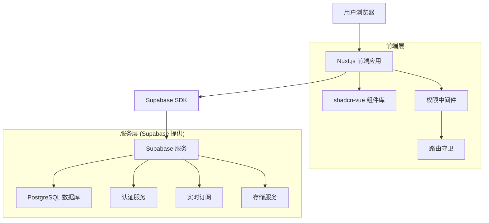
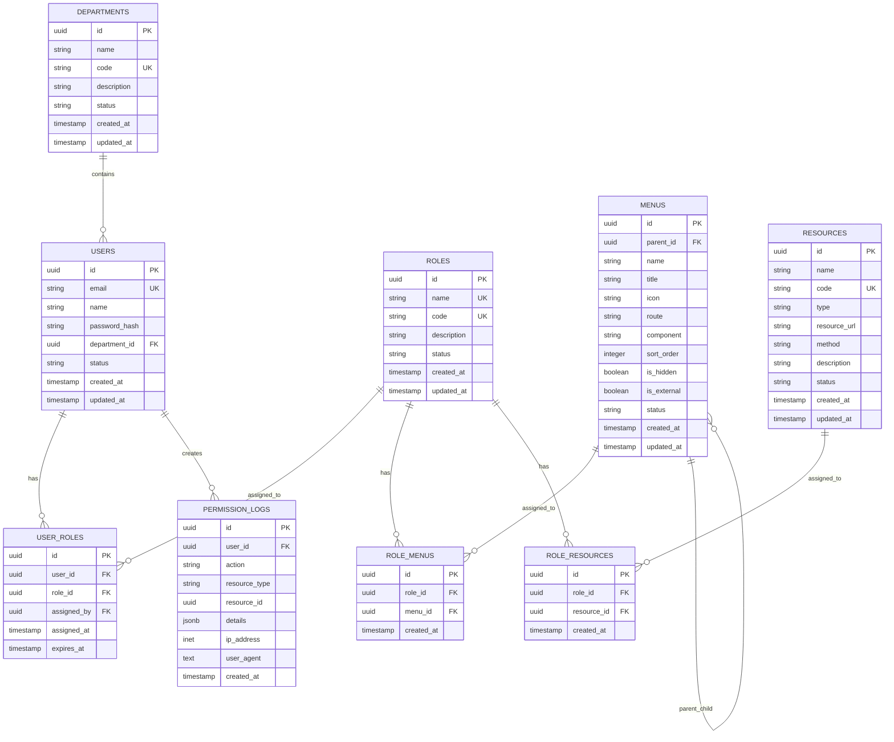

# ERP系统技术架构设计文档

## 1. 架构设计



## 2. 技术描述

- **前端**: Nuxt.js\@3 + Vue.js\@3 + TypeScript + Tailwind CSS + shadcn-vue

- **后端**: Supabase (PostgreSQL + 认证 + 实时订阅)

- **UI组件库**: shadcn-vue + Lucide Vue Next (图标)

- **状态管理**: Pinia (集成在Nuxt.js中)

- **构建工具**: Vite

- **部署**: Vercel

## 3. 路由定义

| 路由                   | 用途                 | 权限要求           |
| ---------------------- | -------------------- | ------------------ |
| /                      | 首页，重定向到仪表板 | 需要登录           |
| /login                 | 登录页面             | 公开访问           |
| /register              | 注册页面             | 公开访问           |
| /dashboard             | 仪表板，显示系统概览 | 需要登录           |
| /users                 | 用户管理页面         | 需要用户管理权限   |
| /system/menus          | 菜单管理页面         | 需要系统管理权限   |
| /system/roles          | 角色管理页面         | 需要角色管理权限   |
| /system/permissions    | 权限管理页面         | 需要权限管理权限   |
| /master-data/customers | 客户管理             | 需要客户管理权限   |
| /master-data/suppliers | 供应商管理           | 需要供应商管理权限 |
| /master-data/products  | 产品管理             | 需要产品管理权限   |
| /warehouse/inventory   | 库存管理             | 需要库存管理权限   |
| /sales/orders          | 销售订单管理         | 需要销售管理权限   |
| /purchase/orders       | 采购订单管理         | 需要采购管理权限   |
| /production/plans      | 生产计划管理         | 需要生产管理权限   |
| /reports/sales         | 销售报表             | 需要报表查看权限   |

## 4. API定义

### 4.1 认证相关API

**用户登录**

```
POST /auth/v1/token
```

请求参数:

| 参数名   | 参数类型 | 是否必需 | 描述     |
| -------- | -------- | -------- | -------- |
| email    | string   | true     | 用户邮箱 |
| password | string   | true     | 用户密码 |

响应参数:

| 参数名        | 参数类型 | 描述     |
| ------------- | -------- | -------- |
| access_token  | string   | 访问令牌 |
| refresh_token | string   | 刷新令牌 |
| user          | object   | 用户信息 |

### 4.2 权限管理API

**获取用户菜单**

```
GET /rest/v1/rpc/get_user_menus
```

请求参数:

| 参数名  | 参数类型 | 是否必需 | 描述   |
| ------- | -------- | -------- | ------ |
| user_id | uuid     | true     | 用户ID |

响应参数:

| 参数名 | 参数类型 | 描述                 |
| ------ | -------- | -------------------- |
| menus  | array    | 用户可访问的菜单列表 |

**检查用户权限**

```
GET /rest/v1/rpc/check_user_permission
```

请求参数:

| 参数名        | 参数类型 | 是否必需 | 描述     |
| ------------- | -------- | -------- | -------- |
| user_id       | uuid     | true     | 用户ID   |
| resource_code | string   | true     | 资源代码 |

响应参数:

| 参数名         | 参数类型 | 描述       |
| -------------- | -------- | ---------- |
| has_permission | boolean  | 是否有权限 |

### 4.3 菜单管理API

**获取菜单列表**

```
GET /rest/v1/menus
```

**创建菜单**

```
POST /rest/v1/menus
```

请求参数:

| 参数名     | 参数类型 | 是否必需 | 描述     |
| ---------- | -------- | -------- | -------- |
| name       | string   | true     | 菜单名称 |
| title      | string   | true     | 菜单标题 |
| icon       | string   | false    | 菜单图标 |
| route      | string   | false    | 路由地址 |
| parent_id  | uuid     | false    | 父菜单ID |
| sort_order | integer  | false    | 排序     |

**更新菜单**

```
PATCH /rest/v1/menus?id=eq.{id}
```

**删除菜单**

```
DELETE /rest/v1/menus?id=eq.{id}
```

### 4.4 角色管理API

**获取角色列表**

```
GET /rest/v1/roles
```

**分配角色菜单**

```
POST /rest/v1/role_menus
```

请求参数:

| 参数名  | 参数类型 | 是否必需 | 描述   |
| ------- | -------- | -------- | ------ |
| role_id | uuid     | true     | 角色ID |
| menu_id | uuid     | true     | 菜单ID |

**分配角色资源**

```
POST /rest/v1/role_resources
```

请求参数:

| 参数名      | 参数类型 | 是否必需 | 描述   |
| ----------- | -------- | -------- | ------ |
| role_id     | uuid     | true     | 角色ID |
| resource_id | uuid     | true     | 资源ID |

## 5. 服务架构图

```mermaid
graph TD
    A[客户端/前端] --> B[Nuxt.js 应用层]
    B --> C[Composables 层]
    C --> D[Supabase 客户端]
    D --> E[Supabase 服务]

    subgraph "前端架构"
        B
        F[页面组件]
        G[UI组件 (shadcn-vue)]
        H[中间件]
        I[插件]
        C
    end

    subgraph "Supabase 服务"
        E
        J[PostgreSQL]
        K[Auth 服务]
        L[实时服务]
        M[存储服务]
    end

    B --> F
    B --> G
    B --> H
    B --> I
    E --> J
    E --> K
    E --> L
    E --> M
```

## 6. 数据模型

### 6.1 数据模型定义



### 6.2 数据定义语言

**权限管理核心表**

```sql
-- 菜单表
CREATE TABLE menus (
    id UUID PRIMARY KEY DEFAULT gen_random_uuid(),
    parent_id UUID REFERENCES menus(id),
    name VARCHAR(100) NOT NULL,
    title VARCHAR(100) NOT NULL,
    icon VARCHAR(50),
    route VARCHAR(200),
    component VARCHAR(200),
    sort_order INTEGER DEFAULT 0,
    is_hidden BOOLEAN DEFAULT false,
    is_external BOOLEAN DEFAULT false,
    status VARCHAR(20) DEFAULT 'active' CHECK (status IN ('active', 'inactive')),
    created_at TIMESTAMP WITH TIME ZONE DEFAULT NOW(),
    updated_at TIMESTAMP WITH TIME ZONE DEFAULT NOW()
);

-- 资源表
CREATE TABLE resources (
    id UUID PRIMARY KEY DEFAULT gen_random_uuid(),
    name VARCHAR(100) NOT NULL,
    code VARCHAR(100) UNIQUE NOT NULL,
    type VARCHAR(20) NOT NULL CHECK (type IN ('api', 'button', 'data')),
    resource_url VARCHAR(500),
    method VARCHAR(10),
    description TEXT,
    status VARCHAR(20) DEFAULT 'active' CHECK (status IN ('active', 'inactive')),
    created_at TIMESTAMP WITH TIME ZONE DEFAULT NOW(),
    updated_at TIMESTAMP WITH TIME ZONE DEFAULT NOW()
);

-- 角色菜单关联表
CREATE TABLE role_menus (
    id UUID PRIMARY KEY DEFAULT gen_random_uuid(),
    role_id UUID NOT NULL REFERENCES roles(id) ON DELETE CASCADE,
    menu_id UUID NOT NULL REFERENCES menus(id) ON DELETE CASCADE,
    created_at TIMESTAMP WITH TIME ZONE DEFAULT NOW(),
    UNIQUE(role_id, menu_id)
);

-- 角色资源关联表
CREATE TABLE role_resources (
    id UUID PRIMARY KEY DEFAULT gen_random_uuid(),
    role_id UUID NOT NULL REFERENCES roles(id) ON DELETE CASCADE,
    resource_id UUID NOT NULL REFERENCES resources(id) ON DELETE CASCADE,
    created_at TIMESTAMP WITH TIME ZONE DEFAULT NOW(),
    UNIQUE(role_id, resource_id)
);

-- 用户角色关联表
CREATE TABLE user_roles (
    id UUID PRIMARY KEY DEFAULT gen_random_uuid(),
    user_id UUID NOT NULL REFERENCES users(id) ON DELETE CASCADE,
    role_id UUID NOT NULL REFERENCES roles(id) ON DELETE CASCADE,
    assigned_by UUID REFERENCES users(id),
    assigned_at TIMESTAMP WITH TIME ZONE DEFAULT NOW(),
    expires_at TIMESTAMP WITH TIME ZONE,
    UNIQUE(user_id, role_id)
);

-- 权限操作日志表
CREATE TABLE permission_logs (
    id UUID PRIMARY KEY DEFAULT gen_random_uuid(),
    user_id UUID REFERENCES users(id),
    action VARCHAR(50) NOT NULL,
    resource_type VARCHAR(50),
    resource_id UUID,
    details JSONB,
    ip_address INET,
    user_agent TEXT,
    created_at TIMESTAMP WITH TIME ZONE DEFAULT NOW()
);

-- 创建索引
CREATE INDEX idx_menus_parent_id ON menus(parent_id);
CREATE INDEX idx_menus_route ON menus(route);
CREATE INDEX idx_menus_sort_order ON menus(sort_order);
CREATE INDEX idx_resources_type ON resources(type);
CREATE INDEX idx_resources_code ON resources(code);
CREATE INDEX idx_role_menus_role_id ON role_menus(role_id);
CREATE INDEX idx_role_menus_menu_id ON role_menus(menu_id);
CREATE INDEX idx_role_resources_role_id ON role_resources(role_id);
CREATE INDEX idx_role_resources_resource_id ON role_resources(resource_id);
CREATE INDEX idx_user_roles_user_id ON user_roles(user_id);
CREATE INDEX idx_user_roles_role_id ON user_roles(role_id);
CREATE INDEX idx_permission_logs_user_id ON permission_logs(user_id);
CREATE INDEX idx_permission_logs_created_at ON permission_logs(created_at DESC);
CREATE INDEX idx_permission_logs_action ON permission_logs(action);

-- 创建更新时间触发器
CREATE OR REPLACE FUNCTION update_updated_at_column()
RETURNS TRIGGER AS $$
BEGIN
    NEW.updated_at = NOW();
    RETURN NEW;
END;
$$ language 'plpgsql';

CREATE TRIGGER update_menus_updated_at BEFORE UPDATE ON menus
    FOR EACH ROW EXECUTE FUNCTION update_updated_at_column();

CREATE TRIGGER update_resources_updated_at BEFORE UPDATE ON resources
    FOR EACH ROW EXECUTE FUNCTION update_updated_at_column();

-- RLS 策略
ALTER TABLE menus ENABLE ROW LEVEL SECURITY;
ALTER TABLE resources ENABLE ROW LEVEL SECURITY;
ALTER TABLE role_menus ENABLE ROW LEVEL SECURITY;
ALTER TABLE role_resources ENABLE ROW LEVEL SECURITY;
ALTER TABLE user_roles ENABLE ROW LEVEL SECURITY;
ALTER TABLE permission_logs ENABLE ROW LEVEL SECURITY;

-- 基础权限
GRANT SELECT ON menus TO anon;
GRANT ALL PRIVILEGES ON menus TO authenticated;
GRANT SELECT ON resources TO anon;
GRANT ALL PRIVILEGES ON resources TO authenticated;
GRANT ALL PRIVILEGES ON role_menus TO authenticated;
GRANT ALL PRIVILEGES ON role_resources TO authenticated;
GRANT ALL PRIVILEGES ON user_roles TO authenticated;
GRANT ALL PRIVILEGES ON permission_logs TO authenticated;

-- 初始化菜单数据
INSERT INTO menus (name, title, icon, route, sort_order) VALUES
('dashboard', '仪表板', 'LayoutDashboard', '/dashboard', 1),
('master-data', '主数据', 'Database', NULL, 2),
('warehouse', '仓库管理', 'Warehouse', NULL, 3),
('sales', '销售管理', 'ShoppingCart', NULL, 4),
('purchase', '采购管理', 'ShoppingBag', NULL, 5),
('production', '生产管理', 'Factory', NULL, 6),
('finance', '财务管理', 'CreditCard', NULL, 7),
('reports', '报表中心', 'BarChart3', NULL, 8),
('system', '系统管理', 'Settings', NULL, 9);

-- 获取父菜单ID并插入子菜单
WITH parent_menus AS (
    SELECT id, name FROM menus WHERE parent_id IS NULL
)
INSERT INTO menus (parent_id, name, title, icon, route, sort_order)
SELECT
    p.id,
    sub.name,
    sub.title,
    sub.icon,
    sub.route,
    sub.sort_order
FROM parent_menus p
CROSS JOIN (
    VALUES
        ('master-data', 'customers', '客户管理', 'Users', '/master-data/customers', 1),
        ('master-data', 'suppliers', '供应商管理', 'Truck', '/master-data/suppliers', 2),
        ('master-data', 'products', '产品管理', 'Package', '/master-data/products', 3),
        ('warehouse', 'inventory', '库存管理', 'Package2', '/warehouse/inventory', 1),
        ('warehouse', 'movements', '库存变动', 'ArrowUpDown', '/warehouse/movements', 2),
        ('sales', 'orders', '销售订单', 'FileText', '/sales/orders', 1),
        ('sales', 'quotations', '销售报价', 'FileEdit', '/sales/quotations', 2),
        ('purchase', 'orders', '采购订单', 'FileText', '/purchase/orders', 1),
        ('purchase', 'requests', '采购申请', 'FileEdit', '/purchase/requests', 2),
        ('production', 'plans', '生产计划', 'Calendar', '/production/plans', 1),
        ('production', 'orders', '生产订单', 'FileText', '/production/orders', 2),
        ('production', 'bom', 'BOM管理', 'GitBranch', '/production/bom', 3),
        ('system', 'users', '用户管理', 'Users', '/system/users', 1),
        ('system', 'roles', '角色管理', 'Shield', '/system/roles', 2),
        ('system', 'menus', '菜单管理', 'Menu', '/system/menus', 3),
        ('system', 'permissions', '权限管理', 'Lock', '/system/permissions', 4)
) AS sub(parent_name, name, title, icon, route, sort_order)
WHERE p.name = sub.parent_name;

-- 初始化资源数据
INSERT INTO resources (name, code, type, resource_url, method, description) VALUES
-- 用户管理资源
('查看用户列表', 'user:list', 'api', '/api/users', 'GET', '查看用户列表权限'),
('创建用户', 'user:create', 'api', '/api/users', 'POST', '创建用户权限'),
('编辑用户', 'user:update', 'api', '/api/users/*', 'PUT', '编辑用户权限'),
('删除用户', 'user:delete', 'api', '/api/users/*', 'DELETE', '删除用户权限'),
('重置密码', 'user:reset-password', 'button', NULL, NULL, '重置用户密码权限'),

-- 角色管理资源
('查看角色列表', 'role:list', 'api', '/api/roles', 'GET', '查看角色列表权限'),
('创建角色', 'role:create', 'api', '/api/roles', 'POST', '创建角色权限'),
('编辑角色', 'role:update', 'api', '/api/roles/*', 'PUT', '编辑角色权限'),
('删除角色', 'role:delete', 'api', '/api/roles/*', 'DELETE', '删除角色权限'),
('分配权限', 'role:assign-permission', 'button', NULL, NULL, '为角色分配权限'),

-- 菜单管理资源
('查看菜单列表', 'menu:list', 'api', '/api/menus', 'GET', '查看菜单列表权限'),
('创建菜单', 'menu:create', 'api', '/api/menus', 'POST', '创建菜单权限'),
('编辑菜单', 'menu:update', 'api', '/api/menus/*', 'PUT', '编辑菜单权限'),
('删除菜单', 'menu:delete', 'api', '/api/menus/*', 'DELETE', '删除菜单权限'),

-- 客户管理资源
('查看客户列表', 'customer:list', 'api', '/api/customers', 'GET', '查看客户列表权限'),
('创建客户', 'customer:create', 'api', '/api/customers', 'POST', '创建客户权限'),
('编辑客户', 'customer:update', 'api', '/api/customers/*', 'PUT', '编辑客户权限'),
('删除客户', 'customer:delete', 'api', '/api/customers/*', 'DELETE', '删除客户权限'),

-- 产品管理资源
('查看产品列表', 'product:list', 'api', '/api/products', 'GET', '查看产品列表权限'),
('创建产品', 'product:create', 'api', '/api/products', 'POST', '创建产品权限'),
('编辑产品', 'product:update', 'api', '/api/products/*', 'PUT', '编辑产品权限'),
('删除产品', 'product:delete', 'api', '/api/products/*', 'DELETE', '删除产品权限'),

-- 库存管理资源
('查看库存', 'inventory:list', 'api', '/api/inventory', 'GET', '查看库存权限'),
('库存调整', 'inventory:adjust', 'api', '/api/inventory/adjust', 'POST', '库存调整权限'),
('库存盘点', 'inventory:count', 'button', NULL, NULL, '库存盘点权限'),

-- 销售管理资源
('查看销售订单', 'sales-order:list', 'api', '/api/sales-orders', 'GET', '查看销售订单权限'),
('创建销售订单', 'sales-order:create', 'api', '/api/sales-orders', 'POST', '创建销售订单权限'),
('编辑销售订单', 'sales-order:update', 'api', '/api/sales-orders/*', 'PUT', '编辑销售订单权限'),
('删除销售订单', 'sales-order:delete', 'api', '/api/sales-orders/*', 'DELETE', '删除销售订单权限'),
('确认订单', 'sales-order:confirm', 'button', NULL, NULL, '确认销售订单权限'),

-- 采购管理资源
('查看采购订单', 'purchase-order:list', 'api', '/api/purchase-orders', 'GET', '查看采购订单权限'),
('创建采购订单', 'purchase-order:create', 'api', '/api/purchase-orders', 'POST', '创建采购订单权限'),
('编辑采购订单', 'purchase-order:update', 'api', '/api/purchase-orders/*', 'PUT', '编辑采购订单权限'),
('删除采购订单', 'purchase-order:delete', 'api', '/api/purchase-orders/*', 'DELETE', '删除采购订单权限'),

-- 生产管理资源
('查看生产计划', 'production-plan:list', 'api', '/api/production-plans', 'GET', '查看生产计划权限'),
('创建生产计划', 'production-plan:create', 'api', '/api/production-plans', 'POST', '创建生产计划权限'),
('编辑生产计划', 'production-plan:update', 'api', '/api/production-plans/*', 'PUT', '编辑生产计划权限'),
('删除生产计划', 'production-plan:delete', 'api', '/api/production-plans/*', 'DELETE', '删除生产计划权限');

-- 创建权限查询函数
CREATE OR REPLACE FUNCTION get_user_menus(p_user_id UUID)
RETURNS TABLE (
    id UUID,
    parent_id UUID,
    name VARCHAR,
    title VARCHAR,
    icon VARCHAR,
    route VARCHAR,
    component VARCHAR,
    sort_order INTEGER,
    is_hidden BOOLEAN,
    is_external BOOLEAN
) AS $$
BEGIN
    RETURN QUERY
    SELECT DISTINCT
        m.id,
        m.parent_id,
        m.name,
        m.title,
        m.icon,
        m.route,
        m.component,
        m.sort_order,
        m.is_hidden,
        m.is_external
    FROM menus m
    INNER JOIN role_menus rm ON m.id = rm.menu_id
    INNER JOIN user_roles ur ON rm.role_id = ur.role_id
    WHERE ur.user_id = p_user_id
      AND m.status = 'active'
      AND (ur.expires_at IS NULL OR ur.expires_at > NOW())
    ORDER BY m.sort_order;
END;
$$ LANGUAGE plpgsql SECURITY DEFINER;

-- 创建权限检查函数
CREATE OR REPLACE FUNCTION check_user_permission(p_user_id UUID, p_resource_code VARCHAR)
RETURNS BOOLEAN AS $$
DECLARE
    has_permission BOOLEAN := FALSE;
BEGIN
    SELECT EXISTS(
        SELECT 1
        FROM user_roles ur
        INNER JOIN role_resources rr ON ur.role_id = rr.role_id
        INNER JOIN resources r ON rr.resource_id = r.id
        WHERE ur.user_id = p_user_id
          AND r.code = p_resource_code
          AND r.status = 'active'
          AND (ur.expires_at IS NULL OR ur.expires_at > NOW())
    ) INTO has_permission;

    RETURN has_permission;
END;
$$ LANGUAGE plpgsql SECURITY DEFINER;

-- 创建权限日志记录函数
CREATE OR REPLACE FUNCTION log_permission_action(
    p_user_id UUID,
    p_action VARCHAR,
    p_resource_type VARCHAR DEFAULT NULL,
    p_resource_id UUID DEFAULT NULL,
    p_details JSONB DEFAULT NULL,
    p_ip_address INET DEFAULT NULL,
    p_user_agent TEXT DEFAULT NULL
)
RETURNS UUID AS $$
DECLARE
    log_id UUID;
BEGIN
    INSERT INTO permission_logs (
        user_id,
        action,
        resource_type,
        resource_id,
        details,
        ip_address,
        user_agent
    ) VALUES (
        p_user_id,
        p_action,
        p_resource_type,
        p_resource_id,
        p_details,
        p_ip_address,
        p_user_agent
    ) RETURNING id INTO log_id;

    RETURN log_id;
END;
$$ LANGUAGE plpgsql SECURITY DEFINER;
```

## 7. 前端架构详细设计

### 7.1 Composables 设计

```typescript
// composables/usePermissions.ts
export const usePermissions = () => {
  const supabase = useSupabaseClient()
  const user = useSupabaseUser()

  const userPermissions = ref<string[]>([])
  const userMenus = ref<Menu[]>([])
  const loading = ref(false)

  // 获取用户菜单
  const getUserMenus = async () => {
    if (!user.value) return []

    loading.value = true
    try {
      const { data, error } = await supabase.rpc('get_user_menus', { p_user_id: user.value.id })

      if (error) throw error

      userMenus.value = data || []
      return data
    } catch (error) {
      console.error('获取用户菜单失败:', error)
      return []
    } finally {
      loading.value = false
    }
  }

  // 检查权限
  const checkPermission = async (resourceCode: string): Promise<boolean> => {
    if (!user.value) return false

    try {
      const { data, error } = await supabase.rpc('check_user_permission', {
        p_user_id: user.value.id,
        p_resource_code: resourceCode,
      })

      if (error) throw error

      return data || false
    } catch (error) {
      console.error('权限检查失败:', error)
      return false
    }
  }

  // 检查菜单访问权限
  const checkMenuAccess = (route: string): boolean => {
    return userMenus.value.some(menu => menu.route === route)
  }

  // 构建菜单树
  const buildMenuTree = (menus: Menu[]): Menu[] => {
    const menuMap = new Map<string, Menu>()
    const rootMenus: Menu[] = []

    // 创建菜单映射
    menus.forEach(menu => {
      menuMap.set(menu.id, { ...menu, children: [] })
    })

    // 构建树形结构
    menus.forEach(menu => {
      const menuItem = menuMap.get(menu.id)!
      if (menu.parent_id) {
        const parent = menuMap.get(menu.parent_id)
        if (parent) {
          parent.children = parent.children || []
          parent.children.push(menuItem)
        }
      } else {
        rootMenus.push(menuItem)
      }
    })

    return rootMenus
  }

  // 记录权限操作日志
  const logPermissionAction = async (
    action: string,
    resourceType?: string,
    resourceId?: string,
    details?: any
  ) => {
    if (!user.value) return

    try {
      await supabase.rpc('log_permission_action', {
        p_user_id: user.value.id,
        p_action: action,
        p_resource_type: resourceType,
        p_resource_id: resourceId,
        p_details: details,
      })
    } catch (error) {
      console.error('记录权限日志失败:', error)
    }
  }

  return {
    userPermissions: readonly(userPermissions),
    userMenus: readonly(userMenus),
    loading: readonly(loading),
    getUserMenus,
    checkPermission,
    checkMenuAccess,
    buildMenuTree,
    logPermissionAction,
  }
}

// composables/useMenus.ts
export const useMenus = () => {
  const supabase = useSupabaseClient()

  const menus = ref<Menu[]>([])
  const loading = ref(false)

  // 获取所有菜单
  const fetchMenus = async () => {
    loading.value = true
    try {
      const { data, error } = await supabase.from('menus').select('*').order('sort_order')

      if (error) throw error

      menus.value = data || []
      return data
    } catch (error) {
      console.error('获取菜单失败:', error)
      return []
    } finally {
      loading.value = false
    }
  }

  // 创建菜单
  const createMenu = async (menu: CreateMenuDto) => {
    try {
      const { data, error } = await supabase.from('menus').insert(menu).select().single()

      if (error) throw error

      menus.value.push(data)
      return data
    } catch (error) {
      console.error('创建菜单失败:', error)
      throw error
    }
  }

  // 更新菜单
  const updateMenu = async (id: string, menu: UpdateMenuDto) => {
    try {
      const { data, error } = await supabase
        .from('menus')
        .update(menu)
        .eq('id', id)
        .select()
        .single()

      if (error) throw error

      const index = menus.value.findIndex(m => m.id === id)
      if (index !== -1) {
        menus.value[index] = data
      }

      return data
    } catch (error) {
      console.error('更新菜单失败:', error)
      throw error
    }
  }

  // 删除菜单
  const deleteMenu = async (id: string) => {
    try {
      const { error } = await supabase.from('menus').delete().eq('id', id)

      if (error) throw error

      menus.value = menus.value.filter(m => m.id !== id)
    } catch (error) {
      console.error('删除菜单失败:', error)
      throw error
    }
  }

  return {
    menus: readonly(menus),
    loading: readonly(loading),
    fetchMenus,
    createMenu,
    updateMenu,
    deleteMenu,
  }
}
```

### 7.2 中间件设计

```typescript
// middleware/permission.global.ts
export default defineNuxtRouteMiddleware(async to => {
  const { $router } = useNuxtApp()
  const user = useSupabaseUser()
  const { checkMenuAccess, getUserMenus } = usePermissions()

  // 公开路由，无需权限检查
  const publicRoutes = ['/login', '/register', '/forgot-password']
  if (publicRoutes.includes(to.path)) {
    return
  }

  // 检查用户是否已登录
  if (!user.value) {
    return navigateTo('/login')
  }

  // 获取用户菜单权限
  await getUserMenus()

  // 检查菜单访问权限
  if (!checkMenuAccess(to.path)) {
    throw createError({
      statusCode: 403,
      statusMessage: '您没有权限访问此页面',
    })
  }
})
```

### 7.3 权限控制组件

```vue
<!-- components/PermissionWrapper.vue -->
<template>
  <div v-if="hasPermission">
    <slot />
  </div>
  <div v-else-if="showFallback">
    <slot name="fallback">
      <div class="text-muted-foreground text-sm">您没有权限执行此操作</div>
    </slot>
  </div>
</template>

<script setup lang="ts">
interface Props {
  resource?: string
  showFallback?: boolean
}

const props = withDefaults(defineProps<Props>(), {
  showFallback: false,
})

const { checkPermission } = usePermissions()
const hasPermission = ref(true)

// 检查权限
const checkAccess = async () => {
  if (!props.resource) {
    hasPermission.value = true
    return
  }

  hasPermission.value = await checkPermission(props.resource)
}

// 监听资源变化
watch(() => props.resource, checkAccess, { immediate: true })
</script>
```

## 8. 性能优化策略

### 8.1 前端优化

- **代码分割**: 使用动态导入实现路由级别的代码分割

- **组件懒加载**: 大型组件使用 `defineAsyncComponent` 懒加载

- **权限缓存**: 缓存用户权限信息，减少重复查询

- **菜单缓存**: 缓存用户菜单，避免频繁请求

- **图片优化**: 使用 WebP 格式，实现响应式图片

### 8.2 数据库优化

- **索引优化**: 为常用查询字段创建合适的索引

- **查询优化**: 使用 RPC 函数减少多次查询

- **连接池**: 配置合适的数据库连接池大小

- **缓存策略**: 使用 Redis 缓存热点数据

### 8.3 网络优化

- **CDN**: 使用 CDN 加速静态资源加载

- **压缩**: 启用 Gzip/Brotli 压缩

- **HTTP/2**: 使用 HTTP/2 协议

- **预加载**: 关键资源预加载

## 9. 安全策略

### 9.1 认证安全

- **JWT Token**: 使用短期访问令牌和长期刷新令牌

- **密码策略**: 强制使用强密码，定期更换

- **多因素认证**: 支持 TOTP 二次验证

- **会话管理**: 自动过期和强制登出

### 9.2 授权安全

- **最小权限原则**: 用户只获得必需的最小权限

- **权限继承**: 支持角色权限继承

- **动态权限**: 支持运行时权限变更

- **审计日志**: 记录所有权限相关操作

### 9.3 数据安全

- **RLS策略**: 使用 Supabase RLS 实现行级安全

- **数据加密**: 敏感数据加密存储

- **SQL注入防护**: 使用参数化查询

- **XSS防护**: 输入验证和输出编码

## 10. 监控和日志

### 10.1 应用监控

- **性能监控**: 监控页面加载时间和API响应时间

- **错误监控**: 捕获和报告前端错误

- **用户行为**: 跟踪用户操作路径

- **资源使用**: 监控内存和CPU使用情况

### 10.2 安全监控

- **登录监控**: 监控异常登录行为

- **权限监控**: 监控权限变更和异常访问

- **API监控**: 监控API调用频率和异常

- **数据监控**: 监控敏感数据访问

### 10.3 日志管理

- **结构化日志**: 使用JSON格式记录日志

- **日志级别**: 区分不同级别的日志信息

- **日志聚合**: 集中收集和分析日志

- **日志保留**: 设置合理的日志保留策略
