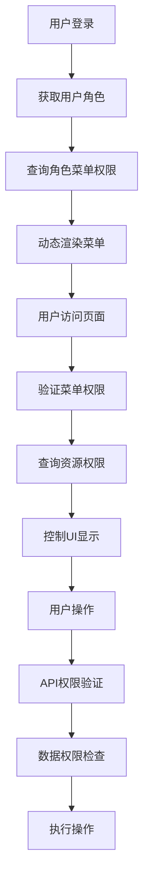

# ERP系统权限管理改进方案

## 1. 项目概述

本文档针对当前ERP系统权限管理的不足，提出完整的改进方案。当前系统存在菜单硬编码、缺少细粒度权限控制、无法实现基于角色的动态菜单等问题，需要建立完整的权限管理体系。

## 2. 核心功能

### 2.1 用户角色

| 角色    | 注册方式       | 核心权限                           |
| ----- | ---------- | ------------------------------ |
| 系统管理员 | 系统初始化创建    | 完整系统管理权限，包括用户管理、角色管理、菜单管理、资源管理 |
| 部门管理员 | 系统管理员创建    | 部门内用户管理、业务数据管理权限               |
| 普通用户  | 管理员创建或邀请注册 | 基础业务操作权限，根据分配角色确定具体权限          |

### 2.2 功能模块

权限管理系统包含以下核心页面：

1. **菜单管理页面**：菜单树形结构展示、菜单增删改查、菜单排序、菜单状态管理
2. **资源管理页面**：API资源管理、按钮权限管理、数据权限配置
3. **角色权限配置页面**：角色菜单分配、角色资源分配、权限预览
4. **用户角色管理页面**：用户角色分配、批量角色操作、权限继承关系
5. **权限审计页面**：权限变更日志、用户操作记录、权限使用统计

### 2.3 页面详情

| 页面名称 | 模块名称   | 功能描述                       |
| ---- | ------ | -------------------------- |
| 菜单管理 | 菜单树组件  | 展示层级菜单结构，支持拖拽排序、展开折叠、快速搜索  |
| 菜单管理 | 菜单表单   | 创建编辑菜单，包含名称、图标、路由、排序、状态等字段 |
| 资源管理 | 资源列表   | 展示API接口、按钮、数据权限等资源，支持分类筛选  |
| 资源管理 | 权限配置   | 配置资源访问规则、数据范围、操作限制         |
| 角色权限 | 权限分配树  | 树形结构分配菜单和资源权限，支持批量操作       |
| 角色权限 | 权限预览   | 实时预览角色权限范围，模拟用户视角          |
| 用户角色 | 角色分配表格 | 用户角色关系管理，支持多角色分配           |
| 权限审计 | 操作日志   | 记录权限变更历史，支持时间范围查询和导出       |

## 3. 核心流程

### 管理员权限配置流程

1. 系统管理员登录 → 菜单管理页面 → 创建/编辑菜单结构
2. 菜单管理页面 → 资源管理页面 → 配置API和按钮权限
3. 资源管理页面 → 角色权限配置页面 → 为角色分配菜单和资源权限
4. 角色权限配置页面 → 用户角色管理页面 → 为用户分配角色

### 普通用户权限验证流程

1. 用户登录 → 系统获取用户角色 → 查询角色菜单权限 → 动态渲染菜单
2. 用户访问页面 → 验证菜单权限 → 查询页面资源权限 → 控制按钮显示
3. 用户操作API → 验证资源权限 → 检查数据权限 → 执行或拒绝操作



## 4. 用户界面设计

### 4.1 设计风格

* **主色调**：蓝色系 (#3B82F6) 作为主色，灰色系 (#6B7280) 作为辅助色

* **按钮样式**：圆角按钮，支持多种尺寸和状态

* **字体**：Inter 字体，主要文字 14px，标题 16-20px

* **布局风格**：卡片式布局，左侧树形导航，右侧内容区域

* **图标风格**：使用 Lucide 图标库，保持一致的线性风格

### 4.2 页面设计概览

| 页面名称 | 模块名称  | UI元素                     |
| ---- | ----- | ------------------------ |
| 菜单管理 | 菜单树组件 | 树形结构，拖拽排序，展开/折叠动画，悬浮操作按钮 |
| 菜单管理 | 菜单表单  | 模态框表单，图标选择器，路由验证，实时预览    |
| 资源管理 | 资源列表  | 表格布局，分类标签，搜索筛选，批量操作工具栏   |
| 角色权限 | 权限分配  | 左右分栏布局，权限树，已选权限列表，操作按钮组  |
| 用户角色 | 角色分配  | 用户列表，角色标签，快速分配下拉菜单       |

### 4.3 响应式设计

桌面优先设计，支持平板和移动端适配。在移动端，树形结构转为手风琴式展开，表格转为卡片列表，确保触摸操作友好。

## 5. 数据库设计

### 5.1 新增表结构

```sql
-- 菜单表
CREATE TABLE menus (
    id UUID PRIMARY KEY DEFAULT gen_random_uuid(),
    parent_id UUID REFERENCES menus(id),
    name VARCHAR(100) NOT NULL,
    title VARCHAR(100) NOT NULL,
    icon VARCHAR(50),
    route VARCHAR(200),
    component VARCHAR(200),
    sort_order INTEGER DEFAULT 0,
    is_hidden BOOLEAN DEFAULT false,
    is_external BOOLEAN DEFAULT false,
    status VARCHAR(20) DEFAULT 'active' CHECK (status IN ('active', 'inactive')),
    created_at TIMESTAMP WITH TIME ZONE DEFAULT NOW(),
    updated_at TIMESTAMP WITH TIME ZONE DEFAULT NOW()
);

-- 资源表
CREATE TABLE resources (
    id UUID PRIMARY KEY DEFAULT gen_random_uuid(),
    name VARCHAR(100) NOT NULL,
    code VARCHAR(100) UNIQUE NOT NULL,
    type VARCHAR(20) NOT NULL CHECK (type IN ('api', 'button', 'data')),
    resource_url VARCHAR(500),
    method VARCHAR(10),
    description TEXT,
    status VARCHAR(20) DEFAULT 'active' CHECK (status IN ('active', 'inactive')),
    created_at TIMESTAMP WITH TIME ZONE DEFAULT NOW(),
    updated_at TIMESTAMP WITH TIME ZONE DEFAULT NOW()
);

-- 角色菜单关联表
CREATE TABLE role_menus (
    id UUID PRIMARY KEY DEFAULT gen_random_uuid(),
    role_id UUID NOT NULL REFERENCES roles(id) ON DELETE CASCADE,
    menu_id UUID NOT NULL REFERENCES menus(id) ON DELETE CASCADE,
    created_at TIMESTAMP WITH TIME ZONE DEFAULT NOW(),
    UNIQUE(role_id, menu_id)
);

-- 角色资源关联表
CREATE TABLE role_resources (
    id UUID PRIMARY KEY DEFAULT gen_random_uuid(),
    role_id UUID NOT NULL REFERENCES roles(id) ON DELETE CASCADE,
    resource_id UUID NOT NULL REFERENCES resources(id) ON DELETE CASCADE,
    created_at TIMESTAMP WITH TIME ZONE DEFAULT NOW(),
    UNIQUE(role_id, resource_id)
);

-- 用户角色关联表
CREATE TABLE user_roles (
    id UUID PRIMARY KEY DEFAULT gen_random_uuid(),
    user_id UUID NOT NULL REFERENCES users(id) ON DELETE CASCADE,
    role_id UUID NOT NULL REFERENCES roles(id) ON DELETE CASCADE,
    assigned_by UUID REFERENCES users(id),
    assigned_at TIMESTAMP WITH TIME ZONE DEFAULT NOW(),
    expires_at TIMESTAMP WITH TIME ZONE,
    UNIQUE(user_id, role_id)
);

-- 权限操作日志表
CREATE TABLE permission_logs (
    id UUID PRIMARY KEY DEFAULT gen_random_uuid(),
    user_id UUID REFERENCES users(id),
    action VARCHAR(50) NOT NULL,
    resource_type VARCHAR(50),
    resource_id UUID,
    details JSONB,
    ip_address INET,
    user_agent TEXT,
    created_at TIMESTAMP WITH TIME ZONE DEFAULT NOW()
);
```

### 5.2 索引创建

```sql
-- 菜单表索引
CREATE INDEX idx_menus_parent_id ON menus(parent_id);
CREATE INDEX idx_menus_route ON menus(route);
CREATE INDEX idx_menus_sort_order ON menus(sort_order);

-- 资源表索引
CREATE INDEX idx_resources_type ON resources(type);
CREATE INDEX idx_resources_code ON resources(code);

-- 关联表索引
CREATE INDEX idx_role_menus_role_id ON role_menus(role_id);
CREATE INDEX idx_role_menus_menu_id ON role_menus(menu_id);
CREATE INDEX idx_role_resources_role_id ON role_resources(role_id);
CREATE INDEX idx_role_resources_resource_id ON role_resources(resource_id);
CREATE INDEX idx_user_roles_user_id ON user_roles(user_id);
CREATE INDEX idx_user_roles_role_id ON user_roles(role_id);

-- 日志表索引
CREATE INDEX idx_permission_logs_user_id ON permission_logs(user_id);
CREATE INDEX idx_permission_logs_created_at ON permission_logs(created_at DESC);
CREATE INDEX idx_permission_logs_action ON permission_logs(action);
```

### 5.3 RLS策略

```sql
-- 启用RLS
ALTER TABLE menus ENABLE ROW LEVEL SECURITY;
ALTER TABLE resources ENABLE ROW LEVEL SECURITY;
ALTER TABLE role_menus ENABLE ROW LEVEL SECURITY;
ALTER TABLE role_resources ENABLE ROW LEVEL SECURITY;
ALTER TABLE user_roles ENABLE ROW LEVEL SECURITY;
ALTER TABLE permission_logs ENABLE ROW LEVEL SECURITY;

-- 基础权限策略
GRANT SELECT ON menus TO anon;
GRANT ALL PRIVILEGES ON menus TO authenticated;
GRANT SELECT ON resources TO anon;
GRANT ALL PRIVILEGES ON resources TO authenticated;
GRANT ALL PRIVILEGES ON role_menus TO authenticated;
GRANT ALL PRIVILEGES ON role_resources TO authenticated;
GRANT ALL PRIVILEGES ON user_roles TO authenticated;
GRANT ALL PRIVILEGES ON permission_logs TO authenticated;
```

## 6. 技术实现方案

### 6.1 前端实现

#### Composables设计

```typescript
// useMenus.ts - 菜单管理
export const useMenus = () => {
  const menus = ref<Menu[]>([])
  const loading = ref(false)
  
  const fetchMenus = async () => {
    // 获取菜单树
  }
  
  const createMenu = async (menu: CreateMenuDto) => {
    // 创建菜单
  }
  
  const updateMenu = async (id: string, menu: UpdateMenuDto) => {
    // 更新菜单
  }
  
  const deleteMenu = async (id: string) => {
    // 删除菜单
  }
  
  const buildMenuTree = (menus: Menu[]) => {
    // 构建菜单树
  }
  
  return {
    menus,
    loading,
    fetchMenus,
    createMenu,
    updateMenu,
    deleteMenu,
    buildMenuTree
  }
}

// usePermissions.ts - 权限管理
export const usePermissions = () => {
  const userPermissions = ref<Permission[]>([])
  const userMenus = ref<Menu[]>([])
  
  const checkPermission = (resource: string) => {
    // 检查用户是否有特定资源权限
  }
  
  const checkMenuAccess = (route: string) => {
    // 检查用户是否有菜单访问权限
  }
  
  const getUserMenus = async () => {
    // 获取用户可访问的菜单
  }
  
  const getUserPermissions = async () => {
    // 获取用户权限列表
  }
  
  return {
    userPermissions,
    userMenus,
    checkPermission,
    checkMenuAccess,
    getUserMenus,
    getUserPermissions
  }
}
```

#### 中间件实现

```typescript
// middleware/permission.global.ts
export default defineNuxtRouteMiddleware((to) => {
  const { checkMenuAccess } = usePermissions()
  const { isAuthenticated } = useAuth()
  
  if (!isAuthenticated.value) {
    return navigateTo('/login')
  }
  
  if (!checkMenuAccess(to.path)) {
    throw createError({
      statusCode: 403,
      statusMessage: '无权限访问此页面'
    })
  }
})
```

### 6.2 组件设计

#### 权限控制组件

```vue
<!-- components/PermissionWrapper.vue -->
<template>
  <div v-if="hasPermission">
    <slot />
  </div>
</template>

<script setup lang="ts">
interface Props {
  resource?: string
  fallback?: boolean
}

const props = withDefaults(defineProps<Props>(), {
  fallback: false
})

const { checkPermission } = usePermissions()

const hasPermission = computed(() => {
  if (!props.resource) return true
  return checkPermission(props.resource)
})
</script>
```

#### 动态菜单组件

```vue
<!-- components/DynamicMenu.vue -->
<template>
  <nav class="space-y-1">
    <template v-for="menu in menuTree" :key="menu.id">
      <MenuItemComponent :menu="menu" />
    </template>
  </nav>
</template>

<script setup lang="ts">
const { userMenus, getUserMenus } = usePermissions()
const { buildMenuTree } = useMenus()

const menuTree = computed(() => buildMenuTree(userMenus.value))

onMounted(() => {
  getUserMenus()
})
</script>
```

## 7. 实施计划

### 第一阶段：数据库结构建立（1-2天）

1. 创建新的权限管理相关表
2. 建立表关系和索引
3. 配置RLS策略
4. 初始化基础数据

### 第二阶段：后端API开发（3-4天）

1. 开发菜单管理API
2. 开发资源管理API
3. 开发角色权限分配API
4. 开发权限验证中间件

### 第三阶段：前端权限框架（3-4天）

1. 开发权限相关Composables
2. 创建权限控制组件
3. 实现动态菜单系统
4. 开发权限验证中间件

### 第四阶段：管理界面开发（4-5天）

1. 菜单管理页面
2. 资源管理页面
3. 角色权限配置页面
4. 用户角色管理页面

### 第五阶段：集成测试和优化（2-3天）

1. 权限系统集成测试
2. 性能优化
3. 用户体验优化
4. 文档完善

## 8. 风险评估

### 技术风险

* **数据迁移风险**：现有用户数据需要平滑迁移到新的权限体系

* **性能风险**：复杂的权限查询可能影响系统性能

* **兼容性风险**：新权限系统需要与现有功能模块兼容

### 解决方案

* 制定详细的数据迁移计划，分步骤执行

* 优化数据库查询，使用缓存机制

* 采用渐进式改造，保证向后兼容

## 9. 成功指标

* 实现100%动态菜单渲染，无硬编码菜单

* 支持细粒度的API和按钮权限控制

* 权限验证响应时间 < 100ms

* 管理员可以通过界面完成所有权限配置

* 系统安全性显著提升，通过安全审计

